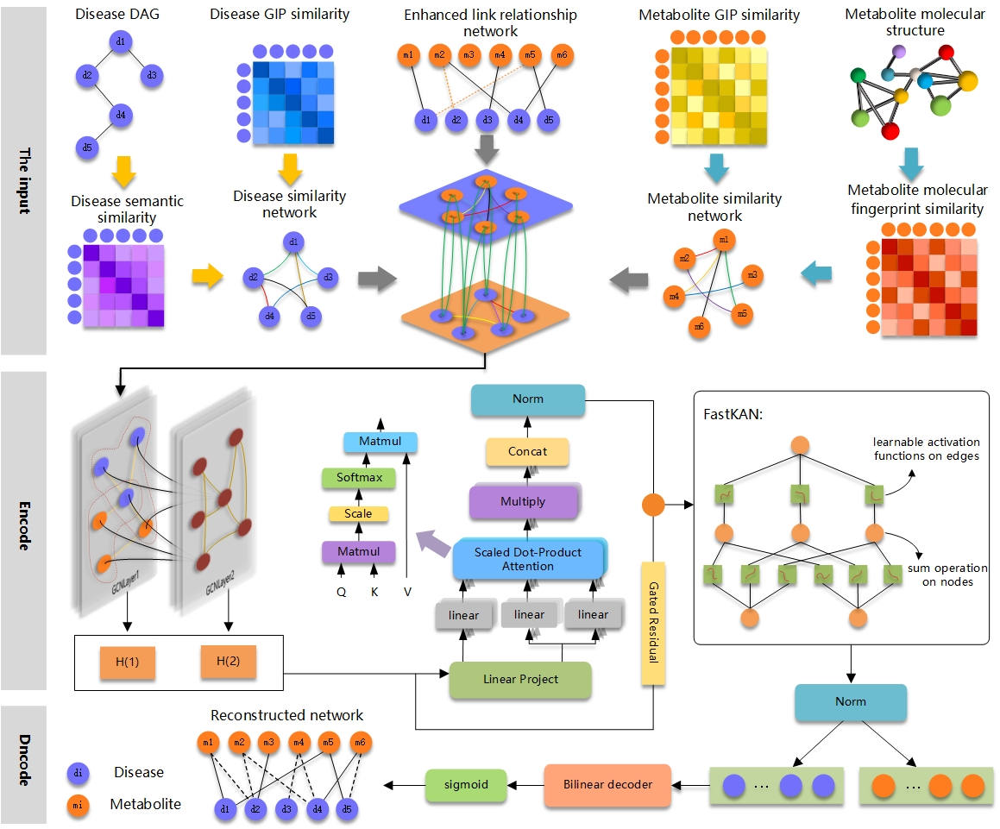

# AGKphormer
Enhanced Metabolite-Disease Associations Prediction via Neighborhood Aggregation Graph Transformer with Fast Kolmogorov-Arnold Networks

## 🏠 Overview



## 🛠️ Dependecies
- Python == 3.9
- pytorch == 1.12.1
- numpy == 1.22.4+mkl
- pandas == 1.4.4


## 🗓️ Dataset
```
disease-metabolite associations: association_matrix.csv and disease-metabolite.xlsx
Disease similarity network: diease_network_simi.csv
Metabolite similarity network: metabolite_ntework_simi.csv
Complete result: association_matrix_completed_admm.csv
```

## 🛠️ Model options
```
--epochs           int     Number of training epochs.                   Default is 200.
--GCNlayers        int     the number of layers in GCN.                 Default is 2.
--MHAheads         int     the number of heads in multi-head attention. Default is 1.
--dropout          float   Dropout rate                                 Default is 0.2.
--lr               float   Learning rate                                Default is 0.005.
--wd               float   weight decay                                 Default is 5e-4.

```

## 🎯 How to run?
```
1. The data folder stores associations and similarities. 
2、Run greedy_modularity_communities.py to get the completed association matrix.
3、Run train.py in the py_code folder to get the experimental results.

```
